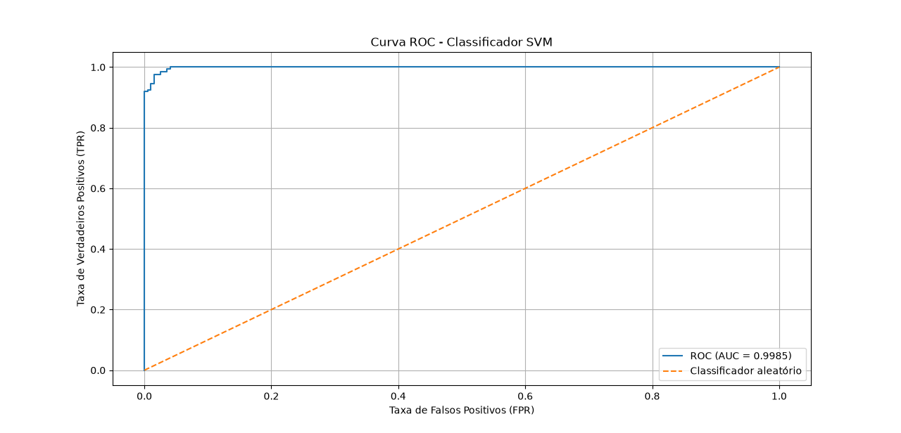

# Esteganálise - Projeto classificador de esteganografia

O projeto implementa um sistema de esteganálise baseado em LSB Replacement, SRM e SVM. Inicialmente, o algoritmo LSB é utilizado para gerar imagens estego, inserindo uma mensagem secreta nos bits menos significativos dos pixels de imagens originais (Cover). Em seguida, as imagens Cover e Stego são processadas pelo Spatial Rich Model (SRM), responsável por extrair características estatísticas relacionadas aos resíduos e às variações locais dos pixels. Essas características são organizadas em vetores e utilizadas como entrada para o treinamento de um Support Vector Machine (SVM), que aprende a distinguir imagens originais de imagens que possuem dados ocultos. Por fim, uma nova imagem pode ser submetida ao mesmo processo de extração de características e classificada pelo modelo como Cover ou Stego. 

A seguir, é demonstrado o passo a passo para a utilização do projeto no PyCharm, utilizando a linguagem Python. Recomenda-se criar uma pasta para cada etapa do projeto, a fim de facilitar a organização e o entendimento da implementação.

I) código LSB_codigo.py é necessário instalar a(s) seguinte(s) biblioteca(s) no terminal: 

- `pip install Pillow`

Nesta etapa, são geradas as imagens **Stego** a partir das imagens **Cover**, que correspondem às imagens originais. O código implementa o algoritmo **LSB Replacement (Inserção Direta)**, utilizado para ocultar uma mensagem nos bits menos significativos dos pixels.

Para os testes, pode ser utilizado o conjunto de imagens **BOSSBase**, disponível no Kaggle. Para realizar o download, acesse o [Google Colab](https://colab.research.google.com/#scrollTo=zwFnJsE6vjf8) e execute os seguintes comandos:

```python
!kaggle datasets download -d lijiyu/bossbase
!ls

from google.colab import files
files.download("/content/bossbase.zip")
```


II) Código SRM_main.py é necessário instalar a(s) seguinte(s) biblioteca(s) no terminal: 

- `pip install opencv-python`
- `pip install numpy`

Esta etapa gera dois arquivos, X_SRM.npy e y_SRM.npy, que deverão ser colocados na pasta referente ao Passo III. O arquivo X_SRM.npy contém as características extraídas das imagens, enquanto o arquivo y_SRM.npy contém os respectivos rótulos das classes Cover e Stego.

III) Código SVM_Classificador.py é necessário instalar a(s) seguinte(s) biblioteca(s) no terminal: 

- `pip install numpy`
- `pip install scikit-learn`
- `pip install joblib`
- `pip install matplotlib`

Insira os arquivos X_SRM.npy e y_SRM.npy na mesma pasta do código SVM_Classificador.py. Esses arquivos contêm, respectivamente, as características extraídas pelo SRM e os rótulos das classes Cover e Stego. Após a execução do código, serão gerados os arquivos modelo_svm.pkl, que contém o modelo SVM treinado, e scaler.pkl, responsável pela padronização das características. Ambos serão utilizados no Passo IV para a classificação de novas imagens.

IV) Código Teste_cover_ou_stego.py é necessário instalar a(s) seguinte(s) biblioteca(s) no terminal: 

- `pip install numpy`
- `pip install opencv-python`
- `pip install joblib`

Insira os arquivos modelo_svm.pkl e scaler.pkl na mesma pasta do código Teste_cover_ou_stego.py. Esses arquivos serão utilizados para realizar a classificação de novas imagens, identificando-as como Cover ou Stego.


### Conclusão

Ao final, o projeto alcançou aproximadamente **97% de acurácia**, indicando que o modelo classificou corretamente cerca de 97% das imagens analisadas entre as classes **Cover** e **Stego**. Além disso, a avaliação por meio da **Curva ROC (Receiver Operating Characteristic)** apresentou uma **AUC (Area Under the Curve) de aproximadamente 99,85%**, demonstrando uma elevada capacidade do classificador SVM em distinguir as duas classes.

#### Curva ROC



**Figura:** Curva ROC do classificador SVM.
